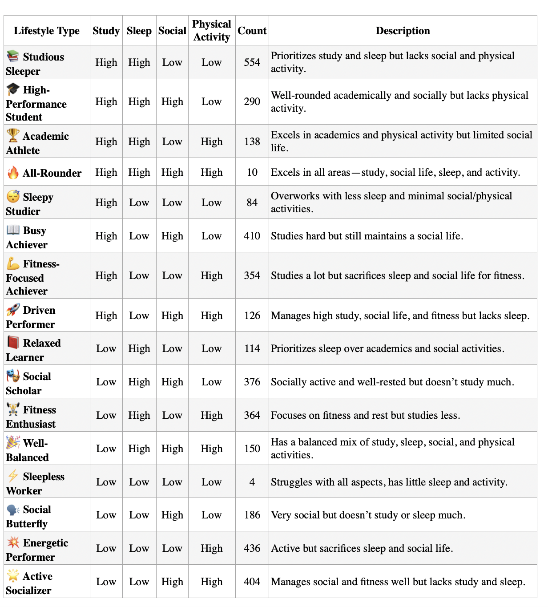
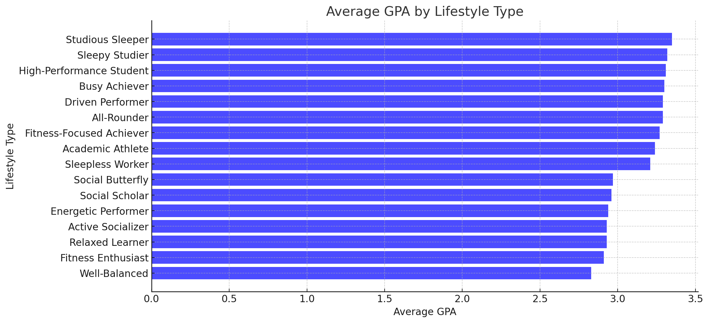
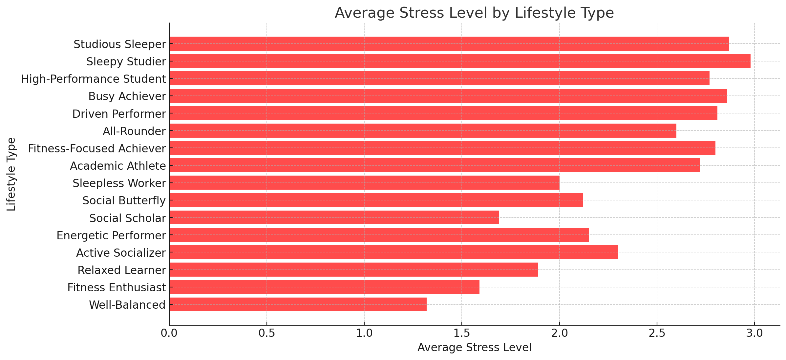

# Introduction
Academic performance and stress levels are influenced by a combination of lifestyle factors, including study habits, physical activity, sleep, and social interactions. While individual behaviors play a role, their combined effects may be more telling. A student who studies extensively but lacks sleep might experience different academic and stress outcomes compared to one who balances study time with physical activity and social engagement. This study examines how different lifestyle patterns—formed by varying levels of study, physical activity, sleep, and social interactions—affect both GPA and stress levels. By identifying these patterns, we aim to uncover how different combinations of habits contribute to student success and well-being.

🔎 Check out SQL queries here: [Queries folder](/Queries/)
# Methodology and Variables
## Data
This study is based on a dataset obtained from Kaggle (source), which includes 2,000 students' daily lifestyle habits recorded over an academic year (August 2023 – May 2024). The dataset captures key aspects of student routines, including study hours, physical activity, sleep duration, and social interactions, along with GPA as a measure of academic performance.

Rather than examining these factors in isolation, students were grouped into lifestyle categories based on their reported levels of study, physical activity, sleep, and social interactions. This classification enables a comparative analysis of how different habit combinations affect both academic success and stress. Notably, stress levels were not self-reported but derived from study and sleep hours, providing an estimate rather than a direct measurement.

By structuring students into lifestyle-based groups, this study aims to uncover patterns that reveal how various daily habits interact to influence both GPA and stress. The dataset serves as a foundation for exploring potential trade-offs between academic commitment, well-being, and overall student performance.
### Defining GPA Categories
```sql
SELECT 
    stress_level,
    CASE 
        WHEN gpa >= 3.7 THEN 'Excellent'
        WHEN gpa >= 3.0 AND gpa < 3.7 THEN 'Above Average'
        WHEN gpa >=2.0 AND gpa <3.0 THEN 'Average'
        WHEN gpa >=1.0 AND gpa <2.0 THEN 'Below Average'
        WHEN gpa >=0.0 AND gpa <1.0 THEN 'Failing'
    END AS gpa_category,
    COUNT(student_id) AS student_count
FROM student_lifestyle
GROUP BY stress_level, gpa_category,stress_level_numeric
ORDER BY gpa_category DESC;
```
### Creating Lifestyle Groups
We classified lifestyle types based on four key aspects: study hours, sleep hours, social hours, and physical activity hours. Each aspect was categorized into low or high, with the median serving as the threshold. Values above the median and below the maximum were classified as high, while values below the median but above the minimum were classified as low. The cutoff values for each category are as follows:



## Analysis
The data suggests a link between stress and GPA. High-stress students are most common in the "Above Average" category (815 students), implying stress may drive academic performance. Moderate stress is more evenly distributed across "Average" and "Above Average" GPAs, while low-stress students are least likely to achieve "Above Average" (55 students). Few students reach "Excellent" GPAs, regardless of stress, indicating top performance may require a balance between stress and motivation.   


| Stress Level | GPA Category    | Student Count |
|-------------|---------------|--------------|
| High        | Excellent     | 47           |
| Moderate    | Excellent     | 1            |
| Moderate    | Average       | 303          |
| Low         | Average       | 242          |
| High        | Average       | 167          |
| Low         | Above Average | 55           |
| High        | Above Average | 815          |
| Moderate    | Above Average | 370          |

***Query***: [Stress and GPA Query](/Queries/1.5_stress_gpa_student_count)

| Lifestyle Type              | Student Count | Avg GPA | Avg Stress | GPA Rank | Stress Rank |
|----------------------------|--------------|---------|------------|----------|-------------|
| Studious Sleeper           | 277          | 3.35    | 2.87       | 1        | 2           |
| Sleepy Studier             | 42           | 3.32    | 2.98       | 2        | 1           |
| High-Performance Student   | 145          | 3.31    | 2.77       | 3        | 6           |
| Busy Achiever              | 205          | 3.30    | 2.86       | 4        | 3           |
| Driven Performer           | 63           | 3.29    | 2.81       | 5        | 4           |
| All-Rounder                | 5            | 3.29    | 2.60       | 5        | 8           |
| Fitness-Focused Achiever   | 177          | 3.27    | 2.80       | 7        | 5           |
| Academic Athlete           | 69           | 3.24    | 2.72       | 8        | 7           |
| Sleepless Worker           | 2            | 3.21    | 2.00       | 9        | 12          |
| Social Butterfly           | 93           | 2.97    | 2.12       | 10       | 11          |
| Social Scholar             | 188          | 2.96    | 1.69       | 11       | 14          |
| Energetic Performer        | 218          | 2.94    | 2.15       | 12       | 10          |
| Active Socializer          | 202          | 2.93    | 2.30       | 13       | 9           |
| Relaxed Learner            | 57           | 2.93    | 1.89       | 13       | 13          |
| Fitness Enthusiast         | 182          | 2.91    | 1.59       | 15       | 15          |
| Well-Balanced              | 75           | 2.83    | 1.32       | 16       | 16          |

***Query***: [Averages for Lifestyle Types](/Queries/2.5_avg_by_types)






# Discussion
### 1. Academic Success is Closely Tied to Sleep & Study Habits
📚 Higher study hours generally lead to better GPA—but only up to a certain point.

Studious Sleeper (8.95 study hrs, 3.35 GPA) and Sleepy Studier (9.10 study hrs, 3.32 GPA) have the highest GPAs.
However, Sleepy Studier has the highest stress level (2.98) due to lack of sleep.
**Studying a lot helps GPA but reducing sleep increases stress drastically.**
### 2. Stress Levels Do Not Always Correlate with Study Time

                More study hours ≠ more stress.

High-Performance Student (8.70 study hrs, 2.77 stress) is less stressed than Sleepy Studier (9.10 study hrs, 2.98 stress), likely due to better sleep.
Busy Achiever (8.77 study hrs, 2.86 stress) balances academics and social life, keeping stress moderate.
Well-Balanced students have the least stress (1.32) but the lowest GPA (2.83), proving that low stress can come at the cost of lower academic performance.

✔️ *Consistent study habits with enough sleep = lower stress and better performance.*

❌ *Extreme overworking (no sleep, excessive studying) = high stress without much GPA benefit.*

### 3. Social Life Hurts GPA but Helps Reduce Stress
            More social interaction tends to reduce stress  but at the cost of academic performance.

Social Butterfly (4.90 social hours, 2.97 GPA, 2.12 stress) and Active Socializer (4.04 social hours, 2.93 GPA, 2.30 stress) focus on social activities.   
Social Scholar (4.40 social hours, 2.96 GPA, 1.69 stress) balances social life well, reducing stress to one of the lowest levels.  
However, none of these are high GPA performers.

✔️ *Good social balance lowers stress but may reduce GPA.*  
❌ *Over-prioritizing social life leads to lower GPA.*

### 4. Fitness Plays a Key Role in Stress Management
            More physical activity = Lower stress levels

Fitness Enthusiast (6.19 physical hrs, 2.91 GPA, 1.59 stress) and Well-Balanced (5.13 physical hrs, 2.83 GPA, 1.32 stress) have some of the lowest stress levels.  
Energetic Performer (8.24 physical hrs, 2.94 GPA, 2.15 stress) is also on the lower side for stress.  
Studious Sleeper (2.19 physical hrs, 3.35 GPA, 2.87 stress) has low fitness activity and higher stress.  

✔️ *Regular physical activity lowers stress and supports overall well-being.*
❌ *However, excessive physical activity may reduce study time, lowering GPA.*

### 5. All-Rounders Are Rare but Have a Strong Balance
GPA (3.29) is among the highest, stress is relatively low (2.60), and they get enough sleep and social interaction.
However, only 5 students fall into this category, making this balance difficult to achieve.

✔️ *Achieving balance across all aspects leads to strong performance in both GPA and stress.*  
❌ *Very few students can successfully maintain this lifestyle.*

### 6. Relaxed and "Balanced" Lifestyles Often Have the Lowest GPAs
            Prioritizing balance, rest, or social life often leads to lower academic results.

Relaxed Learner (2.93 GPA, 1.89 stress) prioritizes sleep but does not achieve high academic performance.  
Well-Balanced (2.83 GPA, 1.32 stress) has the lowest GPA but least stress.  
Social Scholar (2.96 GPA, 1.69 stress) benefits from social life but sacrifices study hours.  

✔️ *If the goal is lower stress, a balanced approach works well.*  
❌ *If high academic achievement is the goal, more study time is necessary.*

### 7. The Most Extreme Lifestyles Are Risky
⚠️ Some students sacrifice too much in one area, leading to severe drawbacks.

Sleepy Studier: High GPA, highest stress due to lack of sleep.
Sleepless Worker: Struggles in all areas, lowest performance.
Energetic Performer: Heavy physical activity at the cost of study and social life.

✔️ *Extreme lifestyles create unintended consequences.*  
❌ *A balance of study, sleep, and social activities is crucial for long-term success.*

# Conclusion 
This analysis highlights the significant impact of lifestyle choices on academic performance, stress levels, and overall student well-being. The findings indicate that students who prioritize both study and sleep tend to achieve the highest GPAs, while those who neglect sleep in favor of excessive study experience elevated stress levels without significant academic benefits. Conversely, students who engage in regular social interactions and physical activity generally report lower stress levels, though often at the cost of academic performance.

A well-balanced lifestyle, encompassing adequate study, sufficient rest, moderate social engagement, and physical activity, appears to foster optimal stress management and long-term success. However, achieving this balance is challenging, as evidenced by the limited number of students classified as "All-Rounders." Additionally, extreme lifestyle choices—whether excessive studying, complete social isolation, or an overemphasis on fitness—tend to yield diminishing academic returns and heightened stress levels.

To optimize both academic achievement and well-being, students should aim to establish structured study habits, prioritize sufficient sleep, integrate social interactions, and incorporate regular physical activity. Institutions and educators can support this by promoting time management strategies, mental health resources, and a holistic approach to student success. By fostering a lifestyle that integrates academic discipline with well-being, students can maximize their potential while maintaining a sustainable and fulfilling university experience.
